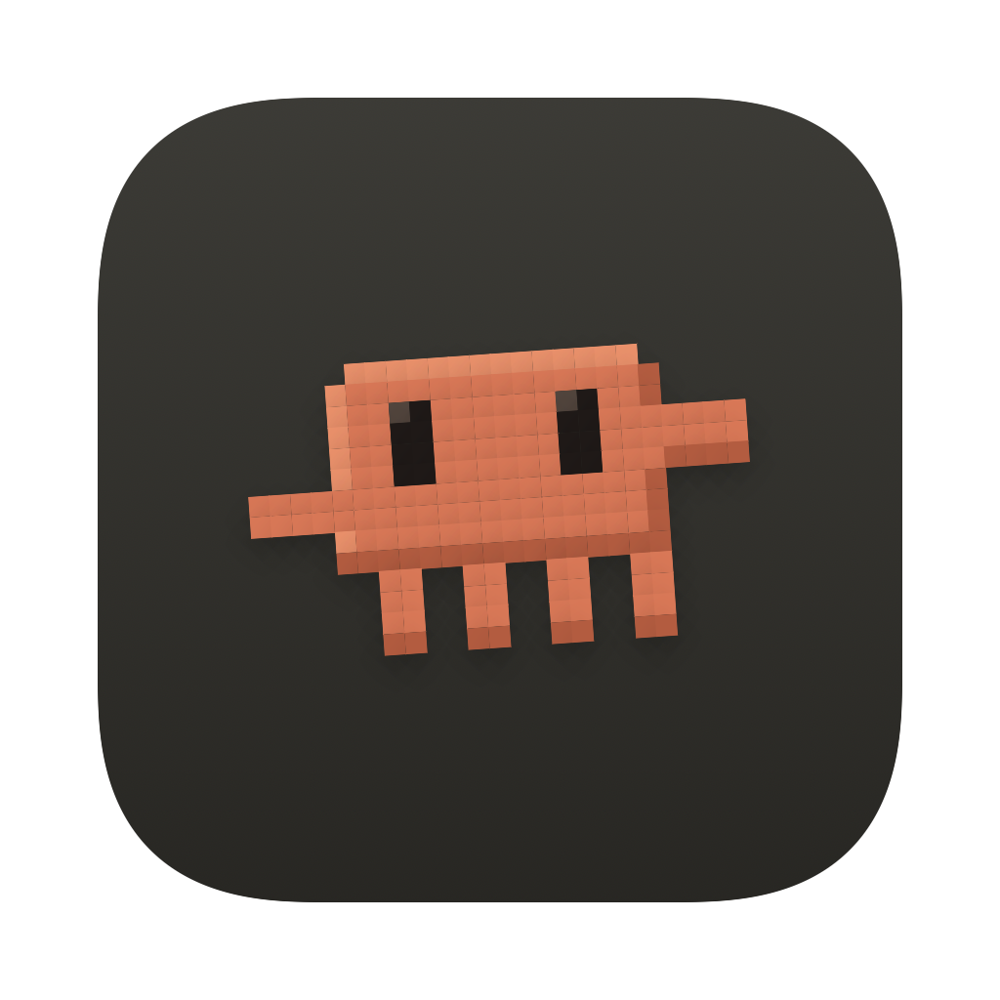
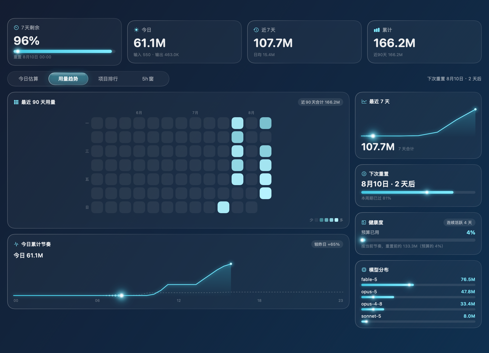
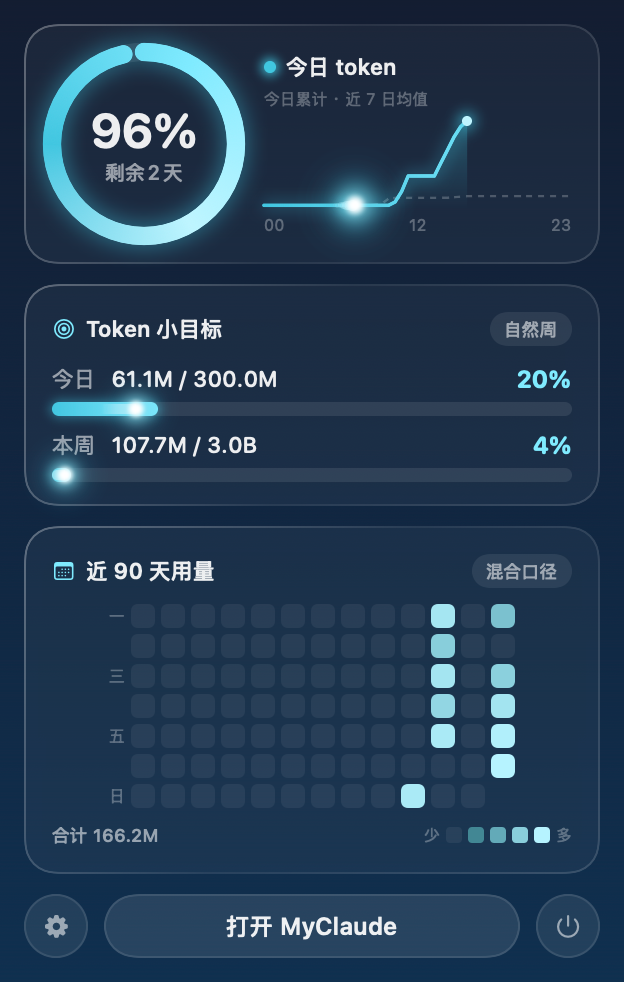
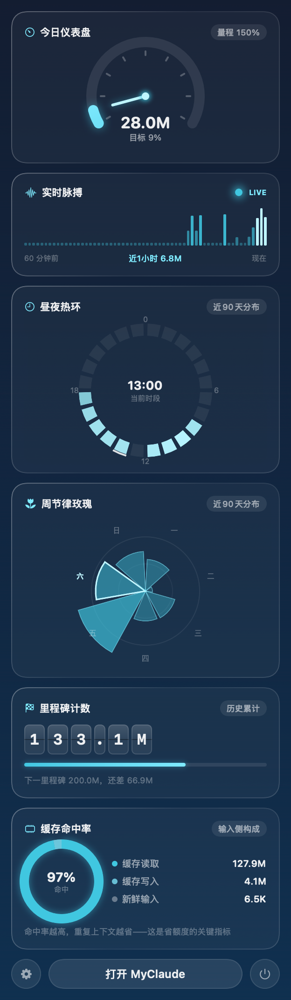
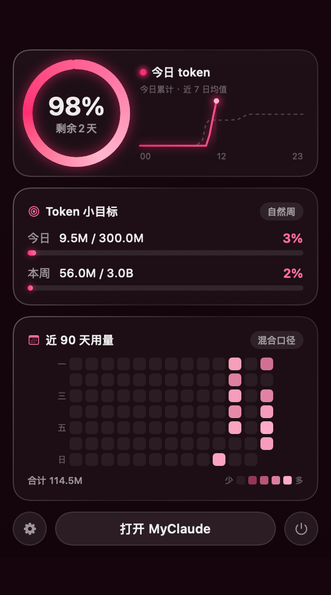
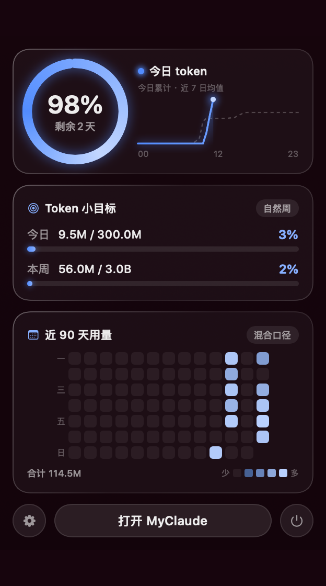

<div align="center">



# MyClaude

**macOS 菜单栏上的 Claude Code 用量仪表盘 · 液态玻璃风格**

实时统计你的 Claude Code token 消耗——今日 / 本周 / 近90天热力图 / 模型分布 / 5小时窗口 / 缓存命中率，
全部渲染在一块透出壁纸的毛玻璃面板上。

`Swift` · `SwiftUI` · `零依赖` · `完全本地` · `v1.0`



</div>

---

## ✨ 功能特性

- **菜单栏常驻**：点击刘海旁的像素 Clawd 小图标，弹出毛玻璃统计面板
- **主仪表盘**：四大统计卡 + 今日估算 / 用量趋势 / 项目排行 / 5h窗 四个标签页（液态玻璃滑块支持**按住拖动**切换）
- **14 个可自选模块**，小面板 / 主面板右栏独立配置：

  | 模块 | 说明 |
  |---|---|
  | 圆环总览 | 周额度剩余圆环 + 今日累计曲线（对比近7日均值） |
  | Token 小目标 | 今日 / 本周目标进度 |
  | 90天热力图 | GitHub 风格贡献格，高用量格子会爆闪 ✨ |
  | 最近7天 | 逐日折线 + 合计 |
  | 下次重置 | 周期倒计时 |
  | 健康度 | 预算消耗节奏外推 + 连续活跃天数 |
  | 模型分布 | Opus / Sonnet / Fable… 各模型用量排行 |
  | 今日仪表盘 | 240° 速度表 + 发光指针 |
  | 实时脉搏 | 近60分钟逐分钟频谱 + LIVE 呼吸灯 |
  | 昼夜热环 | 24小时钟面，看清你是白天型还是深夜型 |
  | 周节律玫瑰 | 极坐标玫瑰图 + 声呐光环 |
  | 里程碑计数 | 机械翻牌里程表 |
  | 缓存命中率 | 输入侧构成环——省额度关键指标 |
  | GitHub 仓库 | 一键连接 GitHub，显示最近推送的仓库 |

- **动态光效**（15 个独立开关）：热力图星空爆闪、曲线彗星巡游（带拖尾）、进度条光点穿梭、柱状图能量上涌、玫瑰声呐脉冲——全部随机相位，关掉的模块连动画时钟都不运行
- **液态玻璃 UI**：`NSVisualEffectView` 桌面级模糊，面板颜色由背后壁纸透出；卡片带镜面高光描边
- **主题自定义**：8 个预设 + 任意取色，圆环 / 曲线 / 热力图梯度全套自动推导；玻璃染色强度可调
- **GitHub 设备授权流**：点一下按钮 → 浏览器授权 → 自动连接，凭证存系统钥匙串
- **鼠标悬浮说明**：设置里悬停任意模块芯片，浮出详细介绍卡

## 📸 截图

| 菜单栏面板 | 炫酷模块 |
|---|---|
|  |  |

| 主题色：霓虹粉（默认） | 主题色：深海蓝 |
|---|---|
|  |  |

> 截图为应用离屏渲染（真实数据）；实机上背景是透出壁纸的毛玻璃，且所有光效都是动态的。

## 🚀 安装

### 方式一：下载 Release（推荐）

1. 从 [Releases](../../releases) 下载 `MyClaude.zip` 并解压
2. 把 `MyClaude.app` 拖进「应用程序」文件夹
3. **首次打开：右键 App → 打开 → 再点「打开」**（无开发者签名，直接双击会被 Gatekeeper 拦截；只需一次）
4. 菜单栏出现像素 Clawd 图标即成功

> 要求：Apple Silicon Mac（M1+）· macOS 13+ · 安装并使用过 [Claude Code](https://claude.com/claude-code)

### 方式二：从源码构建

只需要 Xcode Command Line Tools（不需要完整 Xcode）：

```bash
git clone https://github.com/CyberLinkPan/MyClaude.git
cd MyClaude
./build.sh
open MyClaude.app
```

> `build.sh` 内置了对 CLT 混装损坏（SwiftBridging 重复定义）的自动绕过（VFS overlay + 显式模块构建），健康的工具链上同样适用。

## 🧭 使用说明

| 操作 | 方式 |
|---|---|
| 打开小面板 | 点击菜单栏 Clawd 图标 |
| 打开主仪表盘 | 小面板底部「打开 MyClaude」，或双击 App 图标 |
| 切换标签页 | 点击或**按住玻璃滑块左右拖动**（越过分界有触觉反馈） |
| 设置 | 小面板左下角 ⚙️ |
| 退出 | 小面板右下角 ⏻ |

**设置界面（横向三栏）**：

- **外观**：主题色（8 预设 + 自由取色）、玻璃染色与强度、模块光效开关（15 项独立）
- **模块显示**：小面板 / 主面板右栏各自点选，附「恢复默认」；悬停芯片查看模块详细介绍
- **目标与周期**：今日目标、每周预算、重置星期与时刻、菜单栏数字开关
- **GitHub**：「一键连接」走设备授权流（等同 `gh auth login`，授权记录显示为 GitHub CLI，可随时撤销）；也可手动粘贴 Token

## 📊 数据说明与隐私

- 数据源：本机 `~/.claude/projects/**/*.jsonl`（Claude Code 会话记录），按 `message.id + requestId` 去重
- 口径：**输入 + 输出 + 缓存写入 + 缓存读取**（混合口径），每 30 秒增量刷新
- **完全本地**：用量数据不上传任何服务器；解析时只提取 token 数量、模型名、时间戳、项目路径，不收集对话内容
- 唯一联网功能是 GitHub 模块（api.github.com），不连接则完全离线；凭证存 macOS 钥匙串
- 每日目标 / 每周预算为自定义估算值（Anthropic 未公开按 token 计的限额），请按自己的订阅档位调整

## ❓ FAQ

**打不开，提示已损坏或无法验证开发者？**
右键 → 打开；或系统设置 → 隐私与安全性 → 「仍要打开」；终端方案：`xattr -cr /Applications/MyClaude.app`

**菜单栏看不到图标？**
菜单栏图标太多会被刘海挤掉——按住 ⌘ 拖走几个不常用图标，或直接双击 App 打开主窗口

**面板没有数据？**
确认安装并使用过 Claude Code（`~/.claude/projects` 下有 `.jsonl` 文件）

**Intel Mac 能用吗？**
当前 Release 为 arm64；Intel 用户请从源码构建（`build.sh` 会按本机架构编译）

## 🙏 致谢

- 界面灵感来自社区的 MyCodex 用量工具
- 图标为 [Clawd](https://www.starkinsider.com/2025/10/clawd-ai-retro-mascot-command-line.html)——Claude Code 官方像素吉祥物的手工复刻
- 由 [Claude Code](https://claude.com/claude-code) 构建 🤖

## 📄 License

[MIT](LICENSE) © CyberLinkPan
